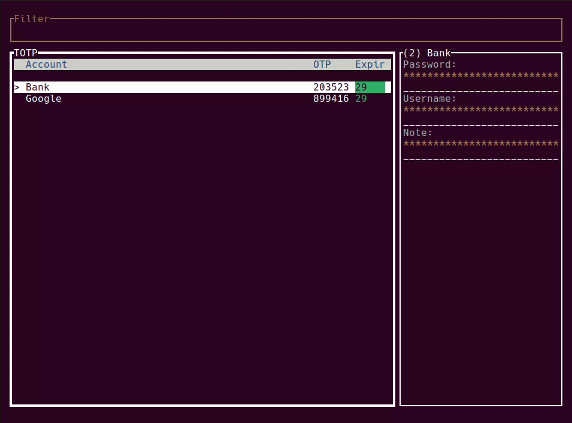

# TROTP

A CLI tool for managing TOTP accounts.
All accounts are stored in a local file that's encrypted with the provided password.
If you don't provide the -p argument it will expect the password on stdin.

Running `trotp` without any arguments will run the TUI interface.

[](https://github.com/Krakaw/TOTP/actions/workflows/test.yml)



## Installation

```bash
cargo install trotp
```
## Usage

```bash
trotp --help
```

```
trotp 1.0.0
Krakaw <41575888+Krakaw@users.noreply.github.com>
TUI TOTP generator

USAGE:
    trotp [OPTIONS] [SUBCOMMAND]

OPTIONS:
    -h, --help                         Print help information
    -p, --password <PASSWORD>          The encryption password
    -s, --sqlite-path <SQLITE_PATH>    The sqlite filename [default: .totp.sqlite3]
    -V, --version                      Print version information

SUBCOMMANDS:
    add            Add a new account
    check          Check an OTP
    delete         Delete an account
    dump           Dump the config file
    generate       Generate an OTP
    help           Print this message or the help of the given subcommand(s)
    interactive    Run in interactive mode [default]
    serve          Start an HTTP Server
```

### Add accounts

    tortp -p password add -a AccountName -s SecretToken -u Username -p Password123 -n Note

### Delete an account

    trotp -p password delete -a AccountName

### Check an OTP against a secret for a specific time within a range

    trotp -p password check -t TokenSecretKey -o 123456 -s 2022-06-03T08:35:00+02:00 -r 10  

### Start an HTTP REST server that will return an OTP from your accounts if a name is provided or generate one for a provided secret

    trotp -p password serve

    # Example using a secret for a once off TOTP
    curl localhost:8080/JBSWY3DPEHPK3PXP
    {"account_name":"Secret","code":"359962","expiry":11}

    curl localhost:8080/acc
    {"account_name":"Account 1","code":"783196","expiry":30}

## Key Bindings

### User Interface

#### Global Key Bindings
| Key Binding | Action                  |
|-------------|-------------------------|
| `/`         | Switch to insert mode   |
| `Esc`       | Switch to normal mode   |
| `Tab`       | Toggle password mode    |
| `Ctrl-c`    | Exit                    |
| `Down`      | Select next account     |
| `Up`        | Select previous account |
| `Enter`     | Copy OTP to clipboard   |
